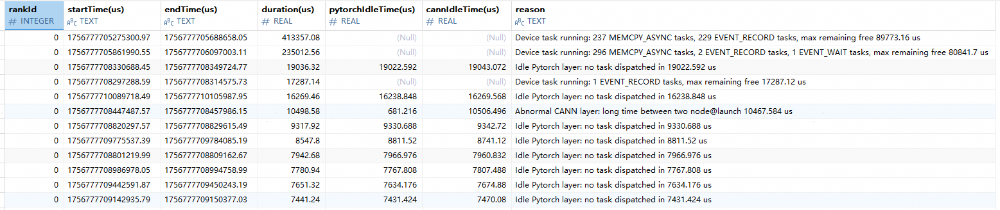

# 空闲时间原因分析

## 简介

空闲时间原因分析（free_analysis）提供了对Device侧大块空闲时间的自动分析能力，能够识别空闲时间产生的原因，帮助用户定位性能问题。该分析能力可以识别以下情况：

* Device侧仍有任务在执行（但不属于计算/通信统计范围）
* PyTorch层长时间未下发任务（host/框架侧idle）
* CANN层存在异常的下发/launch间隔或node@launch耗时偏大

## 使用前准备

**环境准备**

完成msprof-analyze工具安装，具体请参见《[msprof-analyze工具安装指南](../getting_started/install_guide.md)》。

**数据准备**

msprof-analyze需要传入采集的性能数据文件夹，如何采集性能数据请参见[数据准备](./README.md#使用前准备)章节。

## 空闲时间原因分析

**功能说明**

使用msprof-analyze工具的空闲时间原因分析功能，对采集到的集群数据进行分析，识别每个rank中耗时最长的空闲时间及其产生原因。

**命令格式**

```bash
msprof-analyze -m free_analysis -d <cluster_data> [-o <output_path>] [--export_type <export_type>] [--top_num <top_num>]
```

**参数说明**

| 参数 | 可选/必选 | 说明                                     |
| ---- | --------- |----------------------------------------|
| -m   | 必选      | 设置为free_analysis，使能空闲时间原因分析能力。         |
| -d   | 必选      | 集群性能数据文件夹路径。                           |
| -o   | 可选      | 指定输出文件路径，默认为-d参数指定的路径。                 |
| --export_type | 可选 | 指定输出文件类型，可选db或text，默认为db。              |
| --top_num | 可选 | 每个rank输出的Top空闲时间数量（按duration排序），默认为10。 |

更多参数详细介绍请参见msprof-analyze的[参数说明](./README.md#参数说明)。

**使用示例**

执行空闲时间原因分析。

```bash
msprof-analyze -m free_analysis -d ./xxx/cluster_data -o ./xxx/output_path --top_num 10 --export_type text
```

**输出说明**

* 当--export_type设置为db时，在-o参数指定的输出文件路径下生成cluster_analysis.db文件，本功能的分析结果为在该db文件中生成FreeAnalysis表。
* 当--export_type设置为text时，在-o参数指定的输出文件路径下生成cluster_analysis_output/FreeAnalysis/free_analysis.csv文件。
具体介绍请参见[输出结果文件说明](#输出结果文件说明)。

## 输出结果文件说明

本工具分析结果如下图示例：


**FreeAnalysis表**  

表字段如下：

| 字段 | 说明                                         |
| ---- |--------------------------------------------|
| rankId | 卡号，INTEGER类型。                        |
| startTime(us) | 空闲时间开始时间戳，TEXT类型，单位为us。                  |
| endTime(us) | 空闲时间结束时间戳，TEXT类型，单位为us。                   |
| duration(us) | 空闲时间持续时间，REAL类型，单位为us。                   |
| pytorchIdleTime(us) | PyTorch层idle时间，REAL类型，单位为us。无数据时可能为0或NULL。 |
| cannIdleTime(us) | CANN层idle时间，REAL类型，单位为us。无数据时可能为0或NULL。  |
| reason | 空闲原因描述，TEXT类型。                       |

**free_analysis.csv**  

CSV文件列名如下：

| 字段 | 说明 |
| ---- | ---- |
| Rank ID | 卡号，TEXT类型。 |
| Start Time(us) | 空闲时间开始时间戳，TEXT类型，单位为us。 |
| End Time(us) | 空闲时间结束时间戳，TEXT类型，单位为us。 |
| Duration(us) | 空闲时间持续时间，REAL类型，单位为us。 |
| Pytorch Idle Time(us) | PyTorch层idle时间，REAL类型，单位为us。 |
| Cann Idle Time(us) | CANN层idle时间，REAL类型，单位为us。 |
| Reason | 空闲原因描述，TEXT类型。 |
