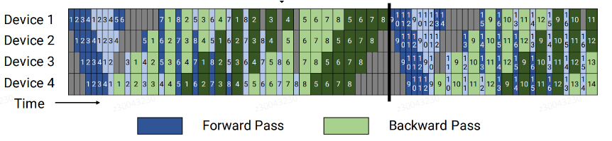
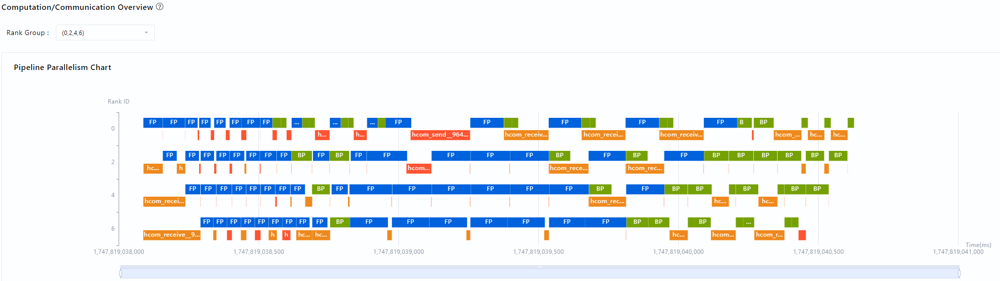

# pp流水图数据分析

## 简介

本节介绍如何采集pp流水图数据、使用msprof-analyze工具分析pp流水图，以及使用MindStudio Insight工具呈现pp流水图进行数据分析。

**pp流水图**指的是将实际pp域内的流水排布进行可视化呈现，可以分析全局通信与前向反向关键耗时信息。对于transformer的模型1F1B、DualPipeV等pp并行策略，当前无法可视化展示。

**1F1B和DualPipeV的理论效果图**




## 使用前准备

**环境准备**

完成msprof-analyze工具安装，具体请参见《[msprof-analyze工具安装指南](../getting_started/install_guide.md)》。

**数据准备**

通过Ascend PyTorch Profiler接口工具的mstx接口采集前向反向数据，需要先找到代码里前向反向相关函数的位置。最终在性能数据timeline上的Ascend HardWare层呈现。

若用户只关注pp流水图，可以设置采集参数profiler_level为Level_none；若还关注前向反向、通信以及send和recv的关联关系，设置采集参数profiler_level为Level1或更高级别。

**约束**

* 采集数据时，需要将Profiling数据导出格式export_type设置为db并开启mstx。
* 以下两个场景的代码仅为打点示例，需要根据用户实际代码，准确找到前向反向函数的位置，参考下面用装饰器的方式实现打点。

* 若项目使用Megatron框架，可直接按照场景一的方法进行打点操作；若项目使用Mindspeed框架，需先确认是否开启DualPipeV功能，若已开启，则按照**场景二**的方法进行打点操作；若无法明确区分，如果能找到对应项目中与打点相关的两个核心文件，在这两个文件的打点代码位置处，添加对应的打点逻辑，确保覆盖所有可能场景。

**场景一：传统pipeline，关闭DualPipeV**

1. 在```megatron/core/pipeline_parallel/schedules.py```里添加如下代码（添加在```backward_step```函数定义的后面）。如下所示：

   ```python
   import torch_npu
   def step_wrapper(func, msg: str):
       def wrapper(*args, **kwargs):
           new_msg = {"name": msg}
           mstx_state_step_range_id = torch_npu.npu.mstx.range_start(str(new_msg), torch_npu.npu.current_stream())
           out = func(*args, **kwargs)
           if mstx_state_step_range_id is not None:
               torch_npu.npu.mstx.range_end(mstx_state_step_range_id)
               mstx_state_step_range_id = None
           return out
       return wrapper
   
   forward_step = step_wrapper(forward_step, "forward_step")
   backward_step = step_wrapper(backward_step, "backward_step")
   ```

2. 保存上述脚本文件后，执行训练。训练完成后，在设置的输出路径下生成性能数据文件，用于后续msprof-analyze工具分析。

**场景二：DualPipeV，找到前向反向代码**

1. 在```mindspeed/core/pipeline_parallel/dualpipev/dualpipev_schedules.py```里添加如下代码（添加在```forward_backward_pipelining_with_cutinhalf```函数定义的前面）。如下所示：

   ```python
   import torch_npu
   def step_wrapper(func, msg: str):
       def wrapper(*args, **kwargs):
           new_msg = {"name": msg}
           if msg == "forward_step_with_model_graph" and kwargs.get("extra_block_kwargs") is not None:
               new_msg["name"] = "forward_backward_overlaping"
           if "current_microbatch" in kwargs:
               new_msg["current_microbatch"] = kwargs["current_microbatch"]
           if msg == "WeightGradStore.pop" and len(WeightGradStore.cache) == 0:
               mstx_state_step_range_id = None
           else:
               mstx_state_step_range_id = torch_npu.npu.mstx.range_start(str(new_msg), torch_npu.npu.current_stream())
           out = func(*args, **kwargs)
           if mstx_state_step_range_id is not None:
               torch_npu.npu.mstx.range_end(mstx_state_step_range_id)
               mstx_state_step_range_id = None
           return out
       return wrapper
   
   forward_step_with_model_graph = step_wrapper(forward_step_with_model_graph, "forward_step_with_model_graph")
   forward_step_no_model_graph = step_wrapper(forward_step_no_model_graph, "forward_step_no_model_graph")
   backward_step_with_model_graph = step_wrapper(backward_step_with_model_graph, "backward_step_with_model_graph")
   backward_step = step_wrapper(backward_step, "backward_step")
   WeightGradStore.pop = step_wrapper(WeightGradStore.pop, "WeightGradStore.pop")
   ```

   若DualPipeV未开启dw分离，添加以下代码后，可完整呈现模型运行前向反向的各个阶段（[理论效果图](#简介)）；若未添加，则仅呈现当前阶段是否为前向或反向。

   采集Profiling数据时，如果使用的是MindSpeed，未使用MindSpeed-LLM，可以在prof定义（```prof = torch_npu.profiler.profile(...)```）的后面添加metadata代码。如下所示：

   ```python
   prof.add_metadata_json('pp_info', json.dumps(
       {
           'pp_type': 'dualpipev',
           'microbatch_num': 10,
       }
   ))
   # microbatch_num根据公式计算实际的值：microbatch_num = global_batch_size // micro_batch_size // data_parallel_size
   ```

   如果使用MindSpeed-LLM，在```mindspeed-llm/training/training.py```中```prof.add_metadata_json('distributed_args'...)```的后面添加metadata代码。如下所示：

   ```python
   prof.add_metadata_json('pp_info', json.dumps(
       {
           'pp_type': args.schedules_method,
           'microbatch_num': args.global_batch_size // args.micro_batch_size // args.data_parallel_size
       }
   ))
   ```

2. 保存上述脚本文件后，执行训练。训练完成后，在设置的输出路径下生成性能数据文件，用于后续msprof-analyze工具分析。

## pp流水图数据分析

**功能说明**

将采集到的pp流水图数据执行msprof-analyze工具分析操作。

**注意事项**

无

**命令格式**

```bash
msprof-analyze cluster -m pp_chart -d <cluster_data_path>
```

**参数说明**

| 参数 | 可选/必选 | 说明                                              |
| ---- | --------- | ------------------------------------------------- |
| -d   | 必选      | 指定[数据准备](#使用前准备)中采集到的集群数据路径。 |

更多参数详细介绍请参见msprof-analyze的[参数说明](./README.md#参数说明)。

**使用示例**

执行数据分析，命令示例如下：

```bash
msprof-analyze cluster -m pp_chart -d ./cluster_data
```

**输出结果文件说明**

完成数据分析后，在每个Rank的数据的ASCEND_PROFILER_OUTPUT/ascend_pytorch_profiler_{rank_id}.db文件中新增StepTaskInfo表。

StepTaskInfo表字段如下：

| 字段 | 说明 |
| ------ | ---- |
| name    | 前向反向信息，TEXT类型，对应pp流水图色块显示的名称。 |
| startNs | 前向反向task在device上开始时间，INTEGER类型。 |
| endNs   | 前向反向task在device上结束时间，INTEGER类型。 |
| type    | 类型，不同类型显示不同颜色，INTEGER类型。 |

用户无需关注该表字段的具体含义，可以直接使用MindStudio Insight呈现。MindStudio Insight工具的详细安装和操作请参见《[MindStudio Insight工具用户指南](https://gitcode.com/Ascend/msinsight/blob/master/docs/zh/user_guide/overview.md)》。

在MindStudio Insight工具导入分析后的性能数据，在Summary页面点击Generate后按照如下截图配置。


如下为pp_chart完成pp流水图分析后的呈现效果。


