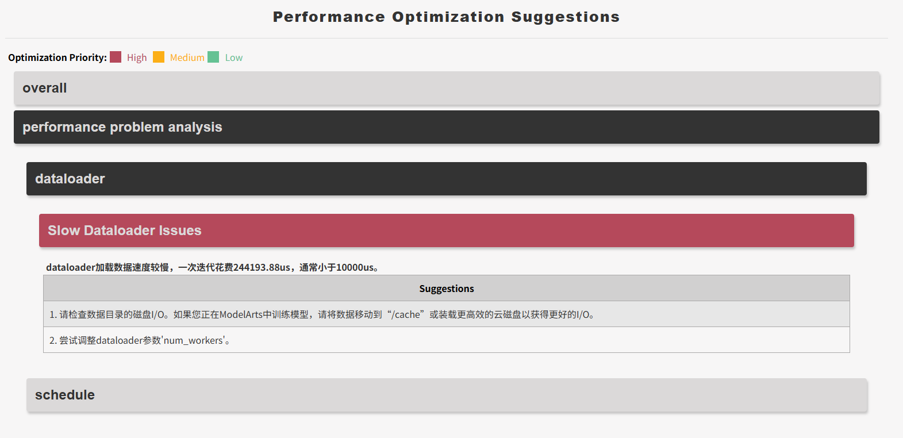

# 快速入门

本教程旨在帮助你快速上手 `msprof-analyze` 工具，提供一个最小示例，涵盖从采集性能数据、执行 advisor 分析到查看分析结果的完整流程。

## 第一步：安装工具

```bash
pip install -U msprof-analyze
```

更多安装方式请参见 [《安装指南》](./install_guide.md)。

## 第二步：生成样例 profiling 数据

`msprof-analyze` 需要输入 profiling 数据目录。首次体验时，推荐直接使用附录中的 [train_sample.py](#附录) 生成 Ascend PyTorch Profiler 样例数据。该脚本通过 `torch_npu.profiler` 采集 ResNet50 训练任务性能数据，并将结果输出至 `./result` 目录。

```bash
python train_sample.py
```

运行后，终端会打印类似如下信息：

```text
[INFO] Using device: npu:0
[Epoch 1/5] Average Loss: 2.5849
[Epoch 2/5] Average Loss: 2.5526
[Epoch 3/5] Average Loss: 2.2174
[Epoch 4/5] Average Loss: 2.0562
[2026-03-24 03:44:40] [INFO] [3956593] profiler.py: Start parsing profiling data in sync mode at: /home/result/msprof_3954534_20260324034427358_ascend_pt
[2026-03-24 03:44:49] [INFO] [3956641] profiler.py: CANN profiling data parsed in a total time of 0:00:08.090306
[2026-03-24 03:44:53] [INFO] [3956593] profiler.py: All profiling data parsed in a total time of 0:00:12.392744
[Epoch 5/5] Average Loss: 1.9166
```

执行完成后，生成以 `ascend_pt` 结尾的目录，即后续执行 advisor 分析时需要传入的 profiling 路径。示例目录结构如下：

```text
msprof_3978075_20260324035119296_ascend_pt/
├── ASCEND_PROFILER_OUTPUT
├── FRAMEWORK
├── logs
└── PROF_000001_20260324035119333_03978075KFFEDFAM
```

## 第三步：运行 advisor 分析

执行一次完整的专家建议分析：

```bash
# 需要将 {..._ascend_pt} 替换为实际生成的 profiling 目录名称。
msprof-analyze advisor all \
  -d ./result/{..._ascend_pt} \
  -o ./advisor_output
```

其中：

- `-d` 指定 profiling 数据目录。
- `-o` 指定分析结果输出目录。
- `advisor all` 表示同时分析计算、调度、通信和整体瓶颈。

## 第四步：查看分析结果

分析完成后，`./advisor_output` 目录下会生成以下结果文件：

- `mstt_advisor_<timestamp>.html`
- `log/mstt_advisor_<timestamp>.xlsx`

其中：

- HTML 文件适合快速浏览整体结论和优化建议。
- XLSX 文件适合进一步查看明细数据。

可以直接打开 HTML 报告查看结果。下面是一个报告页面示例：本次样例检测出了 dataloader 数据加载耗时问题，并将其标记为最高优先级，同时给出了相应的优化建议。



## 下一步阅读

- [《专家建议》](../user_guide/advisor_instruct.md)
- [《性能比对》](../user_guide/compare_tool_instruct.md)
- [《集群分析》](../user_guide/cluster_analyse_instruct.md)
- [《高级特性导航》](../advanced_features/README.md)

## 附录

train_sample.py:  ResNet50 训练示例，使用 `torch_npu.profiler` 采集性能数据

```python
import torch
import torch.nn as nn
import torch.optim as optim
import torchvision.models as models
from torchvision.models import ResNet50_Weights
import torch_npu


class ResNet50:
    def __init__(self, num_classes=1000, device=None):
        # Automatically choose the device: NPU > CUDA > CPU
        if device is None:
            if hasattr(torch, 'npu') and torch.npu.is_available():
                self.device = torch.device("npu:0")
            else:
                self.device = torch.device("cuda:0" if torch.cuda.is_available() else "cpu")
        else:
            self.device = torch.device(device)
        print(f"[INFO] Using device: {self.device}")

        # Load ResNet50 (with pretrained weights)
        self.model = models.resnet50(weights=ResNet50_Weights.IMAGENET1K_V1)
        if num_classes != 1000:
            self.model.fc = nn.Linear(self.model.fc.in_features, num_classes)
        self.model = self.model.to(self.device)

    def train(self, data_loader, epochs=5, lr=1e-4, freeze_backbone=False):
        """
        Simple training function.
        :param data_loader: torch.utils.data.DataLoader returning (images, labels)
        :param epochs: Number of epochs to train for
        :param lr: Learning rate
        :param freeze_backbone: Whether to freeze the ResNet backbone, only training the classification head
        """
        # Optionally freeze the backbone (useful for fine-tuning)
        if freeze_backbone:
            for param in self.model.parameters():
                param.requires_grad = False
            for param in self.model.fc.parameters():
                param.requires_grad = True

        # Optimize only parameters that require gradients
        params_to_optimize = [p for p in self.model.parameters() if p.requires_grad]
        optimizer = optim.Adam(params_to_optimize, lr=lr)
        criterion = nn.CrossEntropyLoss().to(self.device)

        self.model.train()

        # torch_npu.profiler experimental configs
        experimental_config = torch_npu.profiler._ExperimentalConfig(
            export_type=[
                torch_npu.profiler.ExportType.Text,
                torch_npu.profiler.ExportType.Db
                ],
            profiler_level=torch_npu.profiler.ProfilerLevel.Level1,
            mstx=False,    
            mstx_domain_include=[],
            mstx_domain_exclude=[],
            aic_metrics=torch_npu.profiler.AiCMetrics.AiCoreNone,
            l2_cache=False,
            op_attr=False,
            data_simplification=True,
            record_op_args=False,
            gc_detect_threshold=None,
            host_sys=[],
            sys_io=False,
            sys_interconnection=False
        )

        with torch_npu.profiler.profile(
            activities=[
                torch_npu.profiler.ProfilerActivity.CPU,
                torch_npu.profiler.ProfilerActivity.NPU
                ],
            schedule=torch_npu.profiler.schedule(wait=0, warmup=1, active=3, repeat=1, skip_first=0),
            on_trace_ready=torch_npu.profiler.tensorboard_trace_handler("./result"),
            record_shapes=False,
            profile_memory=False,
            with_stack=False,
            with_modules=False,
            with_flops=False,
            experimental_config=experimental_config) as prof:
                for epoch in range(epochs):
                    total_loss = 0.0
                    for inputs, labels in data_loader:
                        inputs, labels = inputs.to(self.device), labels.to(self.device)

                        optimizer.zero_grad()
                        outputs = self.model(inputs)
                        loss = criterion(outputs, labels)
                        loss.backward()
                        optimizer.step()

                        total_loss += loss.item()

                    avg_loss = total_loss / len(data_loader)
                    print(f"[Epoch {epoch + 1}/{epochs}] Average Loss: {avg_loss:.4f}")
                    prof.step()


def train():
    trainer = ResNet50(num_classes=10)
    fake_images = torch.randn(80, 3, 224, 224)
    fake_labels = torch.randint(0, 10, (80,))
    dataset = torch.utils.data.TensorDataset(fake_images, fake_labels)
    loader = torch.utils.data.DataLoader(dataset, batch_size=8, shuffle=True)
    trainer.train(loader, epochs=5, lr=1e-3, freeze_backbone=True)


if __name__ == "__main__":
    train()

```
