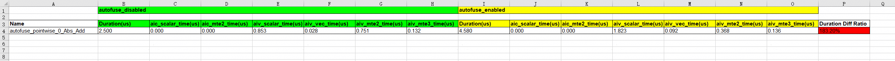

# GE自动融合性能对比

## 简介

GE自动融合性能对比，是指对开启自动融合后的融合算子融合前后的性能进行对比。

## 使用前准备

**约束**

仅支持TensorFlow框架。

**环境准备**

- 硬件环境请参见《[昇腾产品形态说明](https://www.hiascend.com/document/detail/zh/AscendFAQ/ProduTech/productform/hardwaredesc_0001.html)》。

- 软件环境请参见《[CANN 软件安装指南](https://www.hiascend.com/document/detail/zh/canncommercial/850/softwareinst/instg/instg_0000.html?Mode=PmIns&InstallType=local&OS=openEuler)》安装配套版本的CANN Toolkit开发套件包和ops算子包并配置CANN环境变量。

- torch_npu版本大于等于7.2.0，Pytorch仅支持v2.6.0、v2.7.1，具体安装方式请参见《[Ascend Extension for PyTorch](https://www.hiascend.com/document/detail/zh/Pytorch/720/configandinstg/instg/insg_0001.html)》的“安装Pytorch > [方式一：二进制软件包安装](https://www.hiascend.com/document/detail/zh/Pytorch/720/configandinstg/instg/insg_0004.html)”章节。

- 执行构建脚本：

    ```shell
    git clone https://gitcode.com/Ascend/msprof-analyze
    cd msprof-analyze
    # 安装依赖
    pip install -r requirements.txt
    # 构建图执行的so
    cd misc/autofuse_performance_comparison
    bash build.sh
    ```
  脚本执行成功后，autofuse_performance_comparison/lib64路径下生成ExecuteGraph_C.so。

**数据准备**
1. 开启自动融合开关。
    ```shell
    export AUTOFUSE_FLAGS="--enable_autofuse=true"
    ```
    自动融合开关的更多介绍，请参见《[AutoFuse使能方式](https://www.hiascend.com/document/detail/zh/canncommercial/850/graph/autofuse/autofuse_1_0004.html)》。


2. TensorFlow模型运行时开启datadump和自动融合，获取datadump数据和Build图。

- 开启datadump，请参见《[准备NPU侧dump数据和计算图文件](https://www.hiascend.com/document/detail/zh/canncommercial/850/devaids/ModelAccuracyAnalyzer/atlasaccuracy_16_0007.html)》。

- 开启graphdump，可设置以下几个环境变量：

    ```shell
    export PRINT_MODEL=1
    export DUMP_GE_GRAPH=1
    export DUMP_GRAPH_LEVEL=1
    export DUMP_GRAPH_PATH=<dump_path>
    ```
    关于这些环境变量的具体含义，请参见《[dump图文件环境变量](https://www.hiascend.com/document/detail/zh/canncommercial/850/maintenref/envvar/envref_07_0001.html)》。

3. 数据处理。

- dump数据文件转换成npy文件，可以得到对应融合算子的输入和输出，请参见《[dump数据文件Format转换](https://www.hiascend.com/document/detail/zh/canncommercial/850/devaids/ModelAccuracyAnalyzer/atlasaccuracy_16_0054.html)》。

    例如AscBackend.autofuse_pointwise_0_Abs_Add.1.59.1767681027598365转换为npy文件可以得到AscBackend.autofuse_pointwise_0_Abs_Add.1.59.1767681027598365.input.0.npy、AscBackend.autofuse_pointwise_0_Abs_Add.1.59.1767681027598365.input.1.npy和AscBackend.autofuse_pointwise_0_Abs_Add.1.59.1767681027598365.output.0.npy。


- 整图txt文件（例如ge_proto_00000094_graph_1_Build.txt）转换为json格式。
    ```shell
    # 需要source CANN的环境变量
    atc --mode=5 --om=<graph_txt_file_path> --json=<graph_json_file_path>
    ```

## GE自动融合性能对比

**功能说明**

对自动融合开关前后的性能进行对比。该功能通过autofuse_performance_comparison.py脚本实现，该脚本存放路径为：`msprof-analyze/misc/autofuse_performance_comparison/autofuse_core`。

**注意事项**

无

**命令格式**

```shell
python3 autofuse_performance_comparison.py -f <whole_graph> -d <subgraph_dir> -p <dump_path> [-o <output_path>]
```

**参数说明**

| 参数 | 可选/必选 | 说明 |
| ----- |-------| ----- |
| -f<br>--whole_graph  | 必选    | json格式的整图文件，例如`ge_proto_00000094_graph_1_Build.json`。 |
| -d<br>--subgraph_dir | 必选    | 存放所有txt格式子图文件（例如：autofuse_pointwise_0_Abs_Add.txt）的目录。 |
| -p<br>--dump_path   | 必选    | 存放所有融合算子npy格式的dump数据的目录。 |
| -o<br>--output_path | 可选    | 该目录下生成两个子目录autofuse_enabled和autofuse_disabled，分别保存自动融合开关开启和关闭时采集的性能数据，默认为当前路径。用户一般无需关注这个性能数据，只需要查看[输出结果](#输出结果文件说明)即可。 |

**使用示例**

完成使用前准备后，执行如下命令。

```shell
cd misc/autofuse_performance_comparison/autofuse_core
python3 autofuse_performance_comparison.py -f /data/graph_path/ge_proto_00000094_graph_1_Build.json -d /data/graph_path -p /data/dump_path
```

**输出说明**

autofuse_performance_comparison.py脚本执行完成后，在-o参数指定的路径下生成autofuse_performance_comparison_result_{timestamp}.xlsx文件，文件详细介绍请参见[输出结果文件说明](#输出结果文件说明)。

## 输出结果文件说明

GE自动融合性能对比的输出结果在autofuse_performance_comparison_result_{timestamp}.xlsx中呈现。内容如图所示：



**表头字段说明：**

| 字段        | 说明                            |
| --------- |-------------------------------|
| Name | 融合算子名称。 |
| autofuse_disabled和autofuse_enabled | 表示自动融合开关是否开启。 |
| Duration(us) | 融合算子耗时，单位us。|
| Duration Diff Ratio | 融合算子耗时占融合前算子总耗时的百分比。 |

其他表头详细介绍请参见[op_summary](https://www.hiascend.com/document/detail/zh/canncommercial/850/devaids/Profiling/atlasprofiling_16_0067.html)中aic_metrics为PipeUtilization时的字段说明。

**输出结果分析：**
- 融合算子耗时占融合前算子总耗时的百分比小于100%，则认为融合算子性能提升，反之则认为融合算子性能下降。

