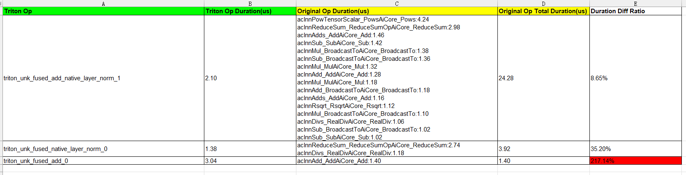

# inductor+triton融合算子性能对比

## 简介

inductor+triton融合算子性能对比，是指对inductor+triton框架自动生成的融合算子融合前后的性能进行对比。

## 使用前准备

**约束**

仅支持Pytorch框架。

**环境准备**

- 硬件环境请参见《[昇腾产品形态说明](https://www.hiascend.com/document/detail/zh/AscendFAQ/ProduTech/productform/hardwaredesc_0001.html)》。

- 软件环境请参见《[CANN 软件安装指南](https://www.hiascend.com/document/detail/zh/canncommercial/850/softwareinst/instg/instg_0000.html?Mode=PmIns&InstallType=local&OS=openEuler)》安装配套版本的CANN Toolkit开发套件包和ops算子包并配置CANN环境变量。

- torch_npu版本大于等于7.2.0，Pytorch仅支持v2.6.0、v2.7.1，具体安装方式请参见《[Ascend Extension for PyTorch](https://www.hiascend.com/document/detail/zh/Pytorch/720/configandinstg/instg/insg_0001.html)》的“安装Pytorch > [方式一：二进制软件包安装](https://www.hiascend.com/document/detail/zh/Pytorch/720/configandinstg/instg/insg_0004.html)”章节。

- clone代码仓。

    ```shell
    git clone https://gitcode.com/Ascend/msprof-analyze
    ```

- 安装依赖

    ```bash
    cd msprof-analyze
    pip install -r requirements.txt
    ```

**数据准备**

1. 准备包含inductor场景的脚本或者模型。

    ```python
    def run(a, b):
        return a + b
    inductor_add = torch.compile(run)
    ```

   上面示例代码定义了一个名为add的函数，然后使用torch.compile进行编译，后端默认是inductor。

2. 通过配置环境变量dump fx图，作为inductor+triton融合算子性能对比的输入。

    ```shell
    export TORCHINDUCTOR_FX_GRAPH_CACHE=0  # 关闭fx graph cache。
    export INDUCTOR_ASCEND_DUMP_FX_GRAPH=1  # 开启dump fx图。
    export INDUCTOR_ASCEND_FX_GRAPH_CACHE=<dump_path>  # 配置fx图dump的路径。
    ```

3. 运行用户程序。

    程序运行结束后，fx图保存在INDUCTOR_ASCEND_FX_GRAPH_CACHE设置的路径下。

## inductor+triton融合算子性能对比

**功能说明**

对inductor+triton框架自动生成的融合算子融合前后的性能进行对比。该功能通过inductor_triton_performance_comparison.py脚本实现，该脚本存放路径为：`msprof-analyze/misc/inductor_triton_performance_comparison`。

**注意事项**

无

**命令格式**

```shell
python3 inductor_triton_performance_comparison.py -d <fx_graph_path> [-o <output_path>]
```

**参数说明**

| 参数 | 可选/必选 | 说明 |
| ----- | ----- | ----- |
| -d<br>--fx_graph_path | 必选 | fx图dump的路径。 |
| -o<br>--output_path  | 可选 | 该目录下生成一个子目录inductor_triton，保存采集到的性能数据，默认为当前路径。用户一般无需关注这个性能数据，只需要查看[输出结果](#输出结果文件说明)即可。 |

**使用示例**

完成使用前准备后，执行如下命令。

```shell
cd misc/inductor_triton_performance_comparison
python3 inductor_triton_performance_comparison.py -d /data/fx_dump
```

**输出说明**

inductor_triton_performance_comparison.py脚本执行完成后，在-o参数指定的路径下生成inductor_triton_performance_comparison_result_{timestamp}.xlsx文件，文件详细介绍请参见[输出结果文件说明](#输出结果文件说明)。

## 输出结果文件说明

性能对比的输出结果在inductor_triton_performance_comparison_result_{timestamp}.xlsx中呈现。内容如图所示：



**表头字段说明：**

| 字段        | 说明                            |
| --------- |-------------------------------|
| Triton Op | inductor+triton框架自动生成的融合算子名称。 |
| Triton Op Duration(us) | 执行耗时，单位us。                    |
| Original Op Duration(us) | 融合前算子以及耗时，按照耗时从高到低排序。         |
| Original Op Total Duration(us)    | 融合前算子总耗时，单位us。                |
| Duration Diff Ratio | 融合后算子耗时占融合前算子总耗时的百分比。         |

**输出结果分析：**

- 展示融合前后算子以及耗时。
- 融合算子耗时占融合前算子总耗时的百分比小于100%，则认为融合算子性能提升，反之则认为融合算子性能下降。
